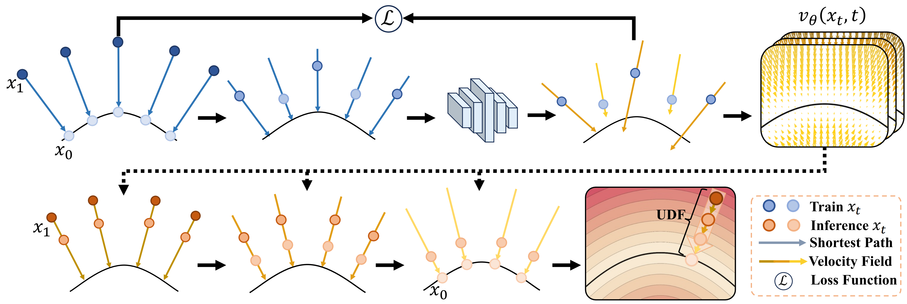

<p align="center">

  <h1 align="center">
    Trajectory Flow: Geometry-Constrained Surface Reconstruction via Unsigned Distance Fields
  </h1>

  <p align="center">
    Chengcheng Yu · Zixu Dun · 
    <a href="https://liuzhengcug.github.io/"><strong>Zheng Liu<sup>†</sup></strong></a>
    · Ying He
  </p>

  <h2 align="center">IEEE Transactions on Visualization and Computer Graphics (TVCG)</h2>

</p>


## Overview

Trajectory Flow is a neural implicit framework for surface reconstruction from raw point clouds.

Instead of independently projecting spatial queries onto the target surface, our method models the continuous evolution of query points toward the underlying surface through a time-conditioned velocity field. By explicitly learning the trajectory of spatial queries, the proposed framework provides structured geometric supervision and enables accurate surface reconstruction from raw point-cloud observations.

In addition, an iterative densification strategy is introduced to progressively enrich the input point cloud with reliable surface samples, improving geometric coverage and reconstruction completeness, especially for sparse and non-uniformly sampled inputs.


<p align="center">
  
</p>


---

## Installation

Our code is implemented in Python 3.9, PyTorch 2.5.1 and CUDA 12.4.

### 1. Create the environment

```bash
conda create -n trajectoryflow python=3.9
conda activate trajectoryflow
```

### 2. Install PyTorch

Please install a PyTorch version compatible with your CUDA environment.

For example:

```bash
conda install pytorch torchvision torchaudio -c pytorch
```

### 3. Install dependencies

```bash
pip install
numpy
point-cloud-utils
trimesh
pyhocon
tensorboard
tqdm
PyMCubes
open3d
matplotlib
scipy
openpyxl
```

---

## Data Preparation

Place the input point clouds under the `data/` directory.

A typical data organization is:

```text
data/
└── DatasetName/
    ├── input/
       ├── shape_0001.ply
       ├── shape_0002.ply
       └── ...
```

---

## Train

The general inference command follows the form:

```bash
python run.py \
    --conf "confs/shapenet_cars.conf" \
    --dir "shapenetcars" \
    --dataname "4235a8f0f7b92ebdbfea8bc24170a935" \
    --gpu 0 \
    --resolution 256
```
## Training with Script

Alternatively, you can run the provided training script for ShapeNet Cars:

```bash
bash ./script/shapenet_cars_train.sh
```
## Use Your Own Data

To reconstruct your own point cloud, place the input file in a dataset folder, for example:

```text
data/
└── MyData/
    └── input/
        └── example.ply
```

Prepare the corresponding configuration file, for example:

```text
confs/MyData.conf
```

Then run:

```bash
python run.py \
    --conf confs/MyData.conf \
    --dir MyData \
    --dataname example \
    --gpu 0 \
    --resolution 256
```

Please make sure that the input normalization, coordinate range, and preprocessing procedure are consistent with the settings used by the released model.

---

## Citation

If you find Trajectory Flow useful for your research, please consider citing our work.

```bibtex
@article{yu2026traflow,
  title={{Trajectory Flow:} Geometry-Constrained Surface Reconstruction via Unsigned Distance Fields},
  author={Yu, Chengcheng and Dun, Zixu and Liu, Zheng and He, Ying},
  journal={IEEE Trans. Vis. Comput. Graph.},
  year={2026},
  volume = {32},
  number = {10},
  pages = {8397-8412}
}
```


---

## Acknowledgements

We thank the authors of previous neural implicit surface reconstruction methods and open-source projects for making their implementations publicly available.
